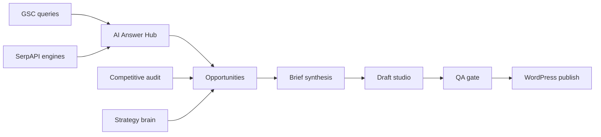

# Architecture

## Layers

| Layer | Responsibility |
|-------|----------------|
| **Contracts** | Shared Pydantic types for agent outputs |
| **Services** | Deterministic business logic |
| **Agents** | Named graphs dispatched by the worker |
| **UI** | Streamlit screens — thin wrappers over services |
| **DB** | Per-site SQLite with explicit migrations |

## Data flow

## Agentic OS wedges (starter → full)

| Wedge | Starter status | Full target |
|-------|----------------|-------------|
| Strategy brain | Rules portfolio | LLM + GSC signals |
| Brief synthesis | Rules outline | Cornerstone intent merge |
| Refresh prescription | Planned | SERP movement + GSC decline |
| Semantic linking | Planned | Hub + inventory |
| QA remediation | Planned | Deterministic + LLM patches |

## Multi-site model

- Registry: `config/sites_registry.json`
- Active site: `.ce/active_site.json` + env `ASOS_SITE_ID` / `ASOS_DB_PATH`
- Never share WP credentials across site databases
